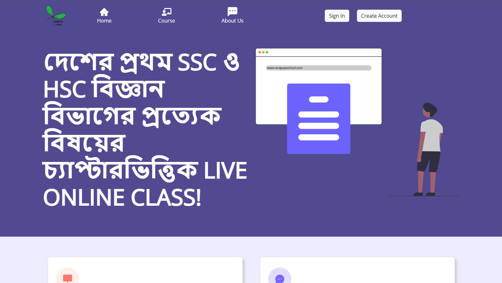

# Wrap Up School

## Introduction

SSC ও HSC বিজ্ঞান বিভাগের সকল শিক্ষার্থীদের জন্য দেশে প্রথমবারের মত WRAP UP SCHOOL নিয়ে এসেছে চ্যাপ্টারভিত্তিক Short term Live ONLINE Courses.
শিক্ষার্থীরা এককভাবে অথবা একসাথে তিনজন মিলে যেকোনো বিষয়ের যেকোনো চ্যাপ্টারের জন্য Course Enroll করে নিতে পারবে। সুযোগ রয়েছে নিজের পছন্দমতো time slot বেছে নেওয়ার। থাকছে প্রতিসপ্তাহের ONGOING নির্দিষ্ট কিছু চ্যাপ্টারের জন্য 1 v 3 কোর্স। যেখানে সর্বোচ্চ তিন জনের একটি ব্যাচে যেকোনো শিক্ষার্থী এককভাবে enroll করে নিতে পারবে। এছাড়াও SSC/HSC পরীক্ষার্থীদের জন্য আছে TEST PAPER এর যেকোনো সমস্যা সমাধান করে নেয়ার সুযোগ। এ ব্যাপারে যেকোনো query থাকলে ইনবক্স করতে পারেন আমাদের পেজে।
বাংলাদেশের প্রেক্ষাপটে প্রতিযোগিতামুলক পরিবেশের কল্যাণে মাধ্যমিক এবং উচ্চ মাধ্যমিকের শিক্ষার্থীদের মধ্যে যেমন সবার থেকে একধাপ এগিয়ে থাকার মনোভাব লক্ষ্যণীয় ঠিক তেমনি প্রতিনিয়ত পিছিয়ে পড়া শিক্ষার্থীদের সংখ্যা ও নেহাত কম নয়। WRAP UP SCHOOL এক্ষেত্রে আপনাকে সাহায্য করতে পারে -
to stay one step ahead or to make a strong comeback.

[Facebook Page](https://www.facebook.com/wrapupschool)

### Enrollment Procedure

